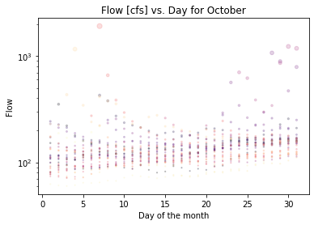
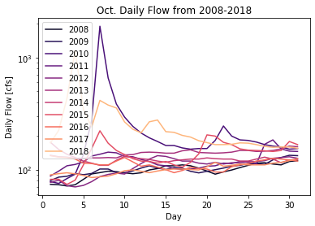

# Week 7 Code Instructions - Steph Serrano
**Instructions on how to run code:**
The instructions are not too complex! Just make sure the language is set to Python and run the cells in the order that they are appear in the script! Thank you!

---
# Code Review:
### Script reviewed by *Jason Schlottman*

**Week 1 Forecast:**
161.0 cfs

**Week 2 Forecast:**
176.0 cfs

**Printed Info From Script:**

    '''Week 1 Forecast Summary:
    This is going to give the median for a given day for a given year.
    Originally, this loop had an array for 31 days.
    I changed the range and storage to only provide data for one specific day/
    in an overly complicated way. I am using the flow for October 11th, 2018/
    as my Week 2 Forecast because I have some thought that the year 2018 is/
    similar, in terms of "wetness", to our current year. I am specifically/
    using the 11th because USGS will update the flow Oct. 11th, 2021.'''

    '''Week 2 Forecast Summary:
    Week 2 has similar reasoning as above except I used the Week 2 date/
    (October 18th) for the year 2018 for my Week 2 forecast.
    This is why the daytemp = x+18.'''

**Plots:**
(note: images of plots are located within the homework-jschlottman2 repository and called through the following filenames in the paths)

**Code Review:**
## Script reviewed by *Jason Schlottman*
## *Assessment:*
  Great job providing an extremely efficient and concise script! The directions are sufficient as the code is written with a minimal amount of lines to return the answers to the prompt along with plots without providing unnecessary extras. There is easy-to-follow pseudocode where needed but the variables are clear and the functions are named so the reader knows exactly what operations are being performed for each step. Not only were operations direct but Stephanie provided explanations and reasoning behind her decisions and why they were important for the forecast results.

## *Numeric Scores:*  

  Q1: Script is easy to read/understand.
  Variables and functions named to match exact description making association easy to comprehend alongside extra pseudocode where needed for more detail. Examples of variables named in this manner appear on lines 29 and 55 where the variables Week1_Forecast & Week1_Forecast are defined.

Q2: Does code follow PEP8 style?
  Code does a good job of following PEP8 formatting style. Syntax is always correct as well as proper terminology, but most importantly the code stays consistent and true to the standards of each guiding format for the type of code element being presented whether a function or variable, etc. These include factors such as indenting by four character spaces consistently or adding extra indents to distinguish between arguments and other functions and text. Imports, acceptable length, and proper naming conventions are all taken into account.

Q3: Is code written succinctly/efficiently?
  Code does a good job of not adding unnecessary steps or breaks where possible. Code is efficient largely by use of a pandas data-frame rather than breaking many conditional statements or redefining parameters and using extra lists. A good example of efficiency in this code is the use of a for loop on line 63, where the length of code could have been extended greatly but luckily the for loop allows quick and simple analysis of the sequence by looping and returning the forecast values through th set of operations present in the loop.
