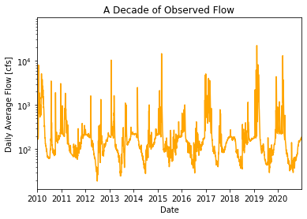
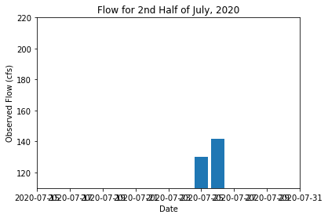
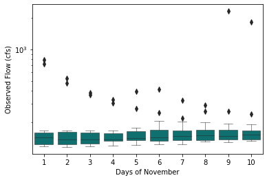
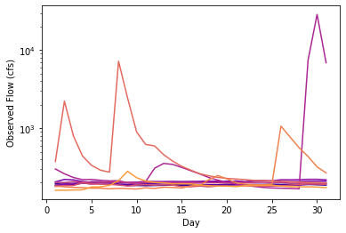
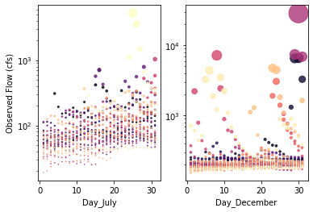
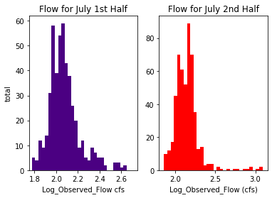

# **Assignment6_matplotlib**
## **Jason Schlottman**
## Week 6 - 10/04/2021
## *Schlottman_HW6.md*

## Grade: 
2.5/3: Good work on the plots. you  need to includ a summary of your forecast values and how you arrived at them though too. 

### Assignment Summary:
#This week the basis for analyzing the streamflow data relies on utilizing the provided starter code while depending on matplotlib functions to perform any operations in order to return reasonable forecast estimate values representing this week's predicted 1-week and 2-week streamflow (cfs).

## Plots:

Plot 1:

I made this very simple time-series by utilizing the example code and depending on the python features 'ax.plot()' and 'ax.set()'.
This plot provides useful insight into the trends of the streamflow over a decade which is a decent amount of time to note annual trends occurring in the data in recent periods. It is also short enough to notice major outlier events which may skew the data heavily during certain flow periods. However this plot gives useful insight into the systematic trends that the flow follows over the recent years.

Plot 2:

This bar plot was developed by using the 'ax.bar' function in python. This plot provides useful insight into flow occurrence over a much shorter break-down period during the second half of July specifically. This is commonly a heavy-flow period during monsoon season when large events often result in heavy flow. The resulting plot can be compared to other weekly or bi-weekly periods to reinforce this estimate. Our plot shows a positive trend in flow as monsoon season continues and progresses which is expected.

Plot 3:

The above boxplot was created by utilizing pythons "sns.barplot()" feature. This plot is extremely useful for analyzing large volumes of data over varying periods and provides insight into which days of the month experience higher flow. In our plot, we can observe a positive trend where flow seems to increase as we continue through the month of November, perhaps this can be attributed to the increase in winter storm events.

Plot 4:

The line plot with a color_palette was created with the prebuilt color_palette-palette known as 'plasma'. This line chart provides insight into how flow varies for each year for the same month of December across a period ranging from 2000-2010. This color-coded display results in a very nice visual comparison of similar event years as well as the years with uncommonly high or low flow events.

Plot 5:

I created the scatter subplots by using the function 'plt.subplots(1,2)' and assigning it to a variable. Then I defined the desired months in conditionals and used the 'scatter()' function to form the plots. These plots show flow as dots for the months of July and December which were chosen as they represent common high-flow event months during summer monsoons and winter storms for the climate type of the region. The dots are color-coded to reflect year of occurrence. This plot is very useful for easily observing trends for large amounts of flow data specific to year, month, and amount.

Plot 6:

These histograms were created as subplots by utilizing the '.hist()' function in python. These subplots are useful for observing flow intensity between two periods, here for the first and second halves of July which is often a high-flow month due to monsoons. We can see here that the first half of July seemed to experience more consistent large events whereas the end of the second half of the month saw a dramatic decrease in both intensity and occurrence.
